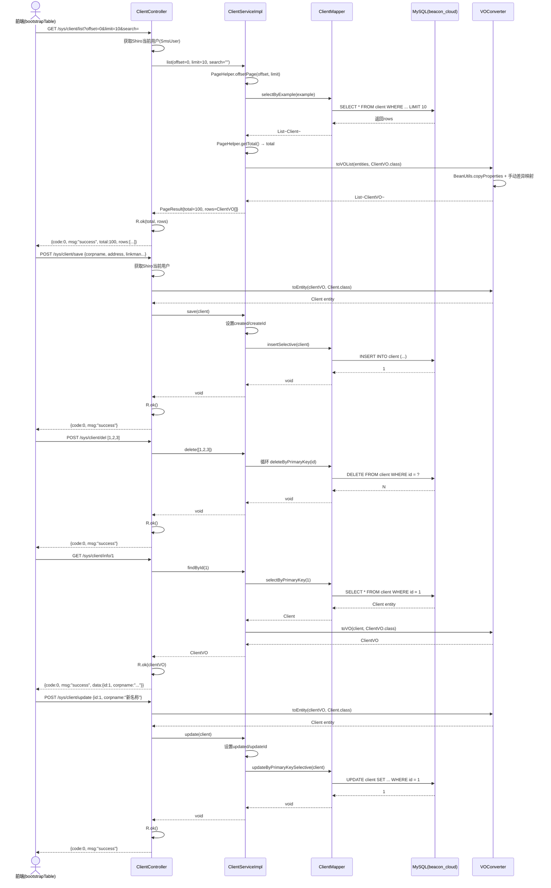
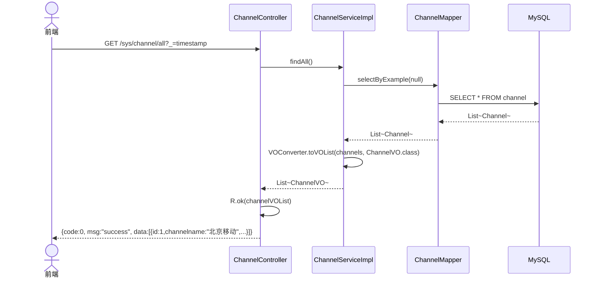
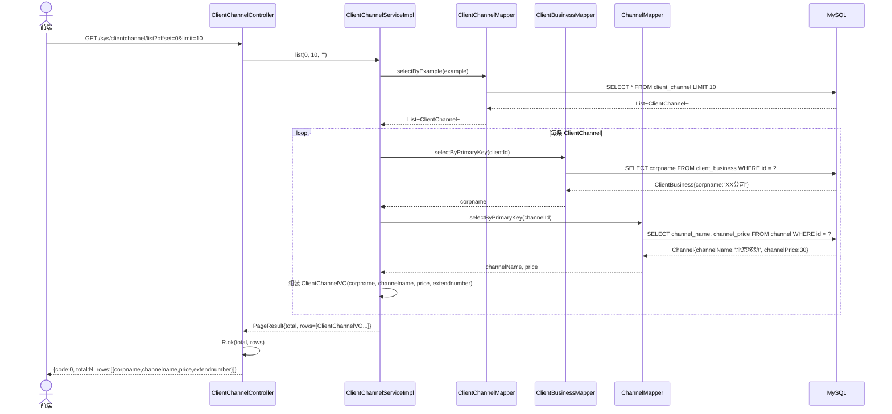
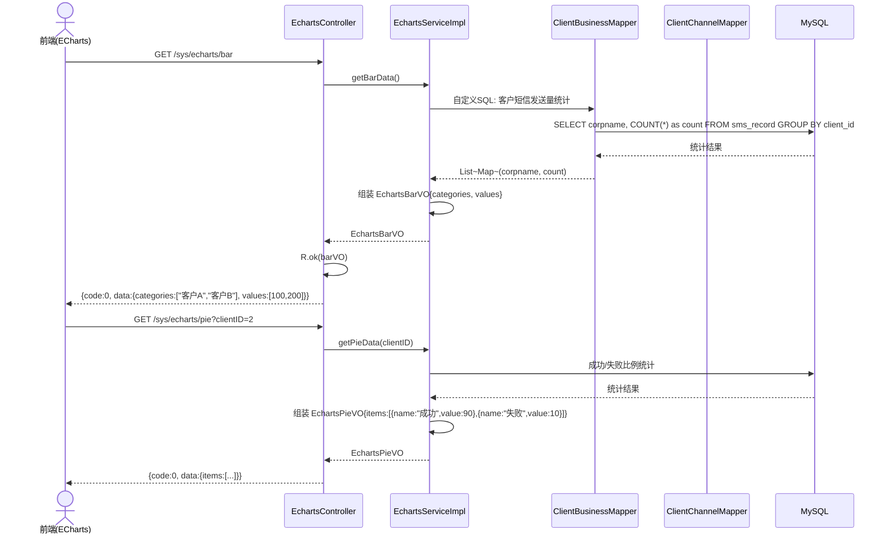
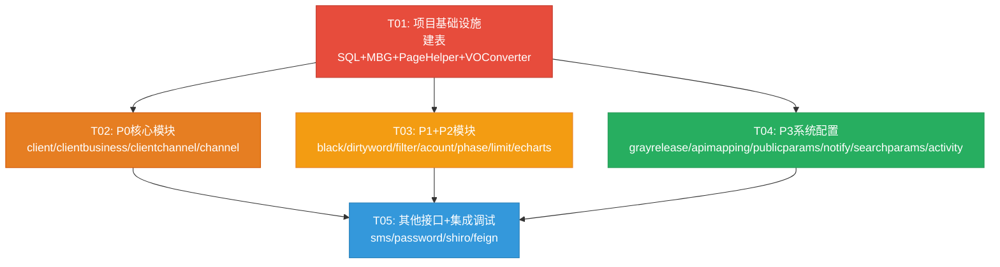

# beacon-webmaster 接口补全架构设计

> 编写日期：2026-07-02  
> 项目：beacon-cloud / beacon-webmaster  
> 架构师：高见远（Gao）

---

## Part A：系统设计

### 1. 实现方案

#### 1.1 核心技术挑战

| 挑战 | 分析 | 解决方案 |
|------|------|----------|
| **前端字段名与DB列名不一致** | 约 12 个模块的前端 JS 字段名与数据库实际列名存在差异（如前端 `mobile` vs DB `blackNumber`；前端 `filterState` vs DB 缺失） | 采用 **VO 映射层** 方案：Entity 严格匹配 DB（MBG 生成），VO 匹配前端字段名，Controller 层做 Entity→VO 转换。MyBatis 已开启 `map-underscore-to-camel-case`，大多数 snake_case→camelCase 自动映射 |
| **9 个模块无对应DB表** | apigatewayfilter、stragetyfilter、activity、grayrelease、apimapping、publicparams、notify、searchparams、sms_phase 模块在数据库中无对应表 | 先编写建表 SQL（`docs/new_tables.sql`），再用 MBG 生成 Entity/Mapper |
| **webmaster 与 synchronization 的 Entity 冲突** | 两个模块的 ClientBusiness 字段不同，且 webmaster pom.xml 未依赖 synchronization | **webmaster 独立生成全套 Entity/Mapper**，不复用 synchronization 的代码，避免依赖冲突和字段差异问题 |
| **分页查询参数格式** | 前端 bootstrapTable 传递 `offset` + `limit`，而 MBG 的 Example 使用 `orderByClause` + 无原生 offset/limit | Service 层统一封装分页逻辑：`PageHelper.offsetLimit()` 或手动 `Example.setLimitClause()`，返回 `{total, rows}` |
| **echarts 数据来源** | 需要统计图表数据（柱状图/折线图/饼图） | 采用 **MySQL 聚合查询** 方案：直接在 Mapper XML 中写 GROUP BY 统计 SQL，简单高效，避免引入 ES 依赖 |
| **sms/save 接口含义** | 前端 smssend.html 调用 `/sys/sms/save` 和 `/sys/sms/update` | **sms/save = 发送短信**：通过 Feign 调用 beacon-api 微服务；**sms/update = 更新短信状态/重发**：同上。不做本地 DB 操作 |

#### 1.2 框架和库选型

| 组件 | 选型 | 版本 | 理由 |
|------|------|------|------|
| **Web 框架** | Spring Boot | 2.3.12 | 已有项目基础，沿用不变 |
| **ORM** | MyBatis + MBG | 2.2.2 / 1.4.2 | 已有项目基础，沿用不变 |
| **认证** | Shiro | 1.4.0 | 已有项目基础，沿用不变 |
| **微服务通信** | OpenFeign | Spring Cloud 默认 | 已有 SearchClient，新增 SmsApiClient |
| **分页** | PageHelper | 5.3.2 | **新增依赖**，轻量级 MyBatis 分页插件，完美支持 offset+limit 模式 |
| **文件上传** | Spring Boot 内置 MultipartFile | — | 不引入额外依赖，使用 Spring 自带文件上传能力 |
| **连接池** | Druid | 1.1.10 | 已有项目基础 |
| **工具** | Lombok | — | 已有项目基础，新 Entity/VO 统一使用 `@Data` |
| **JSON** | Jackson（Spring Boot 内置） | — | 已有项目基础 |

> **新增依赖仅 1 个**：PageHelper（`com.github.pagehelper:pagehelper-spring-boot-starter:1.4.7`），用于统一分页查询。

#### 1.3 架构模式

沿用现有 **三层架构**（Controller → Service → Mapper），不引入新模式：

```
┌─────────────────────────────────────────────────────┐
│                    Controller 层                     │
│  @RestController + @RequestMapping("/sys")           │
│  接收请求 → 认证校验 → 调用 Service → VO 转换 → 返回  │
├─────────────────────────────────────────────────────┤
│                    Service 层                        │
│  Interface + Impl，注入 Mapper                       │
│  业务逻辑 + 分页 + Entity↔VO 转换                    │
├─────────────────────────────────────────────────────┤
│                    Mapper 层                         │
│  MBG 生成 + 自定义统计 SQL                           │
│  Entity + Example + XML                             │
├─────────────────────────────────────────────────────┤
│                    数据库层                           │
│  MySQL (beacon_cloud) + 9 张新表                     │
└─────────────────────────────────────────────────────┘
```

**VO 映射策略决策**（核心）：

- **方案A（VO 类映射）** ✅ **选定**
  - Entity 严格匹配 DB 列名（MBG 生成，`map-underscore-to-camel-case` 自动映射）
  - VO 类字段名严格匹配前端 JS 中的 `field` 定义
  - Controller/Service 层使用 `BeanUtils.copyProperties()` 自动映射同名字段，手动映射差异字段
  - **优势**：前端兼容性 100%，DB 结构不被破坏，Entity 可继续用 MBG 维护

- **方案B（MyBatis ResultMap alias）** ❌ 不选
  - 在 Mapper XML 中做 alias 映射，使查询结果直接匹配前端字段名
  - **劣势**：破坏 MBG 生成代码的一致性，每个 Mapper XML 都需要大量自定义修改

- **方案C（修改 Entity 字段名）** ❌ 不选
  - **劣势**：Entity 字段名与 DB 列名不一致，MBG 后续重新生成会覆盖，维护灾难

---

### 2. 文件列表

所有文件相对于 `beacon-webmaster/src/main/java/org/example/` 或 `beacon-webmaster/src/main/resources/`：

#### 2.1 新建基础设施文件

| 文件路径 | 说明 |
|---------|------|
| `src/main/resources/sql/new_tables.sql` | 9 张新表的建表 SQL |
| `src/main/resources/mapper/PageMapper.xml` | PageHelper 分页拦截器配置（如果需要自定义） |

#### 2.2 P0 模块 — 客户与通道（已有DB表）

| 文件路径 | 说明 |
|---------|------|
| `entity/Client.java` | 客户 Entity（MBG 生成） |
| `entity/ClientExample.java` | 客户查询条件类 |
| `mapper/ClientMapper.java` | 客户 Mapper 接口 |
| `mapper/xml/ClientMapper.xml`（resources/mapper/） | 客户 Mapper XML |
| `service/ClientService.java` | 客户 Service 接口 |
| `service/impl/ClientServiceImpl.java` | 客户 Service 实现 |
| `vo/ClientVO.java` | 客户 VO（字段匹配前端） |
| `controller/ClientController.java` | 客户 CRUD Controller |
| — | — |
| `entity/Channel.java` | 通道 Entity（MBG 重新生成，含完整字段） |
| `entity/ChannelExample.java` | 通道查询条件类 |
| `mapper/ChannelMapper.java` | 通道 Mapper 接口 |
| `resources/mapper/ChannelMapper.xml` | 通道 Mapper XML |
| `service/ChannelService.java` | 通道 Service 接口 |
| `service/impl/ChannelServiceImpl.java` | 通道 Service 实现 |
| `vo/ChannelVO.java` | 通道 VO（channelName→channelname 等映射） |
| `controller/ChannelController.java` | 通道 CRUD + all 辅助 Controller |
| — | — |
| `entity/ClientChannel.java` | 客户通道 Entity（MBG 重新生成） |
| `entity/ClientChannelExample.java` | 客户通道查询条件类 |
| `mapper/ClientChannelMapper.java` | 客户通道 Mapper 接口 |
| `resources/mapper/ClientChannelMapper.xml` | 客户通道 Mapper XML |
| `service/ClientChannelService.java` | 客户通道 Service 接口 |
| `service/impl/ClientChannelServiceImpl.java` | 客户通道 Service 实现 |
| `vo/ClientChannelVO.java` | 客户通道 VO（联表：clientBusiness+channel） |
| `controller/ClientChannelController.java` | 客户通道 CRUD Controller |
| — | — |
| 补充 `entity/ClientBusiness.java` | 重新 MBG 生成（补全缺少字段） |
| 补充 `entity/ClientBusinessExample.java` | 同上 |
| 补充 `mapper/ClientBusinessMapper.java` | 重新生成（补全方法） |
| 补充 `resources/mapper/ClientBusinessMapper.xml` | 重新生成 |
| 补充 `service/ClientBusinessService.java` | 新增 list/del/info/save/update 方法 |
| 补充 `service/impl/ClientBusinessServiceImpl.java` | 实现新增方法 |
| 补充 `vo/ClientBusinessVO.java` | 扩展字段（usercode→apikey, pwd→apikey掩码, ipaddress→ipAddress 等） |
| 补充 `controller/ClientBusinessController.java` | 新增 list/del/info/save/update 接口 |

#### 2.3 P1 模块 — 安全合规（已有DB表）

| 文件路径 | 说明 |
|---------|------|
| `entity/MobileBlack.java` | 黑名单 Entity（MBG 生成） |
| `entity/MobileBlackExample.java` | 黑名单查询条件类 |
| `mapper/MobileBlackMapper.java` | 黑名单 Mapper |
| `resources/mapper/MobileBlackMapper.xml` | 黑名单 Mapper XML |
| `service/MobileBlackService.java` | 黑名单 Service 接口 |
| `service/impl/MobileBlackServiceImpl.java` | 黑名单 Service 实现 |
| `vo/BlackVO.java` | 黑名单 VO（mobile←blackNumber, owntype←clientId, creater←clientId映射） |
| `controller/BlackController.java` | 黑名单 Controller（路径 /sys/black/*） |
| — | — |
| `entity/MobileDirtyWord.java` | 敏感词 Entity（MBG 生成） |
| `entity/MobileDirtyWordExample.java` | 敏感词查询条件类 |
| `mapper/MobileDirtyWordMapper.java` | 敏感词 Mapper |
| `resources/mapper/MobileDirtyWordMapper.xml` | 敏感词 Mapper XML |
| `service/MobileDirtyWordService.java` | 敏感词 Service 接口 |
| `service/impl/MobileDirtyWordServiceImpl.java` | 敏感词 Service 实现 |
| `vo/DirtyWordVO.java` | 敏感词 VO（前端路径 /sys/message/*，字段映射） |
| `controller/MessageController.java` | 敏感词 Controller（路径 /sys/message/*） |
| — | — |
| `entity/ApiGatewayFilter.java` | API网关过滤器 Entity（新表） |
| `entity/ApiGatewayFilterExample.java` | 查询条件类 |
| `mapper/ApiGatewayFilterMapper.java` | Mapper |
| `resources/mapper/ApiGatewayFilterMapper.xml` | Mapper XML |
| `service/ApiGatewayFilterService.java` | Service |
| `service/impl/ApiGatewayFilterServiceImpl.java` | Service Impl |
| `vo/ApiGatewayFilterVO.java` | VO |
| `controller/ApiGatewayFilterController.java` | Controller |
| — | — |
| `entity/StrategyFilter.java` | 策略过滤器 Entity（新表） |
| `entity/StrategyFilterExample.java` | 查询条件类 |
| `mapper/StrategyFilterMapper.java` | Mapper |
| `resources/mapper/StrategyFilterMapper.xml` | Mapper XML |
| `service/StrategyFilterService.java` | Service |
| `service/impl/StrategyFilterServiceImpl.java` | Service Impl |
| `vo/StrategyFilterVO.java` | VO |
| `controller/StragetyFilterController.java` | Controller（拼写保持与前端一致 stragety） |

#### 2.4 P2 模块 — 运营配置（混合：有DB表 + 新表）

| 文件路径 | 说明 |
|---------|------|
| `entity/ClientAccountRecord.java` | 充值记录 Entity（已有表 client_account_record） |
| `entity/ClientAccountRecordExample.java` | 查询条件类 |
| `mapper/ClientAccountRecordMapper.java` | Mapper |
| `resources/mapper/ClientAccountRecordMapper.xml` | Mapper XML |
| `service/ClientAccountRecordService.java` | Service |
| `service/impl/ClientAccountRecordServiceImpl.java` | Service Impl |
| `vo/AcountVO.java` | 充值 VO（前端 acount 字段映射，含联表查询） |
| `controller/AcountController.java` | Controller（路径 /sys/acount/*） |
| — | — |
| `entity/MobileArea.java` | 号段区域 Entity（已有表 mobile_area） |
| `entity/MobileAreaExample.java` | 查询条件类 |
| `mapper/MobileAreaMapper.java` | Mapper |
| `resources/mapper/MobileAreaMapper.xml` | Mapper XML |
| `entity/SmsPhase.java` | 号段配置 Entity（新表 sms_phase） |
| `entity/SmsPhaseExample.java` | 查询条件类 |
| `mapper/SmsPhaseMapper.java` | Mapper |
| `resources/mapper/SmsPhaseMapper.xml` | Mapper XML |
| `service/PhaseService.java` | 号段 Service |
| `service/impl/PhaseServiceImpl.java` | 号段 Service 实现 |
| `vo/PhaseVO.java` | 号段 VO |
| `controller/PhaseController.java` | Controller（含 provs/all + citys/all/{provId}） |
| — | — |
| `entity/CodeLimit.java` | 限流 Entity（已有表 code_limit） |
| `entity/CodeLimitExample.java` | 查询条件类 |
| `mapper/CodeLimitMapper.java` | Mapper |
| `resources/mapper/CodeLimitMapper.xml` | Mapper XML |
| `service/CodeLimitService.java` | Service |
| `service/impl/CodeLimitServiceImpl.java` | Service Impl |
| `vo/LimitVO.java` | 限流 VO（limitTime/limitCount/despcription/limitState 映射） |
| `controller/LimitController.java` | Controller |
| — | — |
| `controller/EchartsController.java` | 图表 Controller（bar/line/pie） |
| `service/EchartsService.java` | 图表 Service |
| `service/impl/EchartsServiceImpl.java` | 图表 Service Impl（MySQL 聚合查询） |
| `vo/EchartsBarVO.java` | 柱状图数据 VO |
| `vo/EchartsLineVO.java` | 折线图数据 VO |
| `vo/EchartsPieVO.java` | 饼图数据 VO |

#### 2.5 P3 模块 — 系统配置（全部新表）

| 文件路径 | 说明 |
|---------|------|
| `entity/GrayRelease.java` + Example | 灰度发布 Entity |
| `mapper/GrayReleaseMapper.java` + XML | Mapper |
| `service/GrayReleaseService.java` + Impl | Service |
| `vo/GrayReleaseVO.java` | VO |
| `controller/GrayReleaseController.java` | Controller |
| — | — |
| `entity/ApiMapping.java` + Example | API映射 Entity |
| `mapper/ApiMappingMapper.java` + XML | Mapper |
| `service/ApiMappingService.java` + Impl | Service |
| `vo/ApiMappingVO.java` | VO |
| `controller/ApiMappingController.java` | Controller |
| — | — |
| `entity/PublicParams.java` + Example | 公共参数 Entity |
| `mapper/PublicParamsMapper.java` + XML | Mapper |
| `service/PublicParamsService.java` + Impl | Service |
| `vo/PublicParamsVO.java` | VO |
| `controller/PublicParamsController.java` | Controller |
| — | — |
| `entity/NotifyConfig.java` + Example | 通知配置 Entity |
| `mapper/NotifyConfigMapper.java` + XML | Mapper |
| `service/NotifyConfigService.java` + Impl | Service |
| `vo/NotifyVO.java` | VO |
| `controller/NotifyController.java` | Controller（路径 /sys/notify/*） |
| — | — |
| `entity/SearchParams.java` + Example | 搜索参数 Entity |
| `mapper/SearchParamsMapper.java` + XML | Mapper |
| `service/SearchParamsService.java` + Impl | Service |
| `vo/SearchParamsVO.java` | VO |
| `controller/SearchParamsController.java` | Controller |
| — | — |
| `entity/Activity.java` + Example | 活动 Entity |
| `mapper/ActivityMapper.java` + XML | Mapper |
| `service/ActivityService.java` + Impl | Service |
| `vo/ActivityVO.java` | VO |
| `controller/ActivityController.java` | Controller（含 /sys/activity/upload） |

#### 2.6 其他模块 — 非标准接口

| 文件路径 | 说明 |
|---------|------|
| `client/SmsApiClient.java` | Feign 客户端调用 beacon-api 发送短信 |
| `controller/SmsController.java` | 短信发送 Controller（/sys/sms/save + /sys/sms/update） |
| `service/SmsService.java` + Impl | 短信发送 Service（调用 SmsApiClient） |
| 补充 `controller/SmsUserController.java` | 新增 /sys/user/password 接口 |
| 补充 `service/SmsUserService.java` | 新增 changePassword 方法 |
| 补充 `service/impl/SmsUserServiceImpl.java` | 实现 changePassword |

#### 2.7 工具/配置文件

| 文件路径 | 说明 |
|---------|------|
| `util/VOConverter.java` | VO 转换工具类（统一 Entity→VO 映射逻辑） |
| `enums/ExceptionEnums.java`（beacon-common） | 新增错误枚举值 |
| `resources/generatorConfig.xml` | 更新 MBG 配置，添加所有新表的生成规则 |

---

### 3. 数据结构和接口

#### 3.1 类图

```mermaid
classDiagram
    direction TB

    class ResultVO~T~ {
        +Integer code
        +String msg
        +T data
        +long total
        +Object rows
    }

    class R {
        +$ok() ResultVO~T~
        +$ok(T data) ResultVO~T~
        +$ok(Long total, Object rows) ResultVO~T~
        +$error(ExceptionEnums) ResultVO~T~
    }

    class ExceptionEnums {
        <<enumeration>>
        NOT_LOGIN(-102)
        PARAMETER_ERROR(-10)
        SMS_SEND_ERROR(-21)
    }

    class VOConverter {
        +$toVO(Entity entity, Class~VO~ voClass) VO$
        +$toVOList(List entities, Class~VO~ voClass) List~VO~
    }

    class BaseCrudService~T~ {
        <<interface>>
        +list(int offset, int limit, String search) PageResult
        +delete(Long[] ids) void
        +findById(Long id) T
        +save(T entity) void
        +update(T entity) void
        +findAll() List~T~
    }

    class BaseCrudServiceImpl~T~ {
        <<abstract>>
        #mapper : Mapper~T~
        +list(offset, limit, search) PageResult
        +delete(ids) void
        +findById(id) T
        +save(entity) void
        +update(entity) void
        +findAll() List~T~
    }

    %% ===== P0: 客户模块 =====
    class Client {
        +Long id
        +String corpname
        +String address
        +String linkman
        +String mobile
        +String email
        +String customermanager
        +Date created
        +Long createId
        +Date updated
        +Long updateId
        +Byte isDelete
    }

    class ClientVO {
        +Long id
        +String corpname
        +String address
        +String linkman
        +String mobile
        +String email
        +String customermanager
    }

    class ClientService {
        <<interface>>
        +list(offset, limit, search) PageResult
        +delete(ids) void
        +findById(id) Client
        +save(client) void
        +update(client) void
    }

    class ClientServiceImpl {
        -clientMapper : ClientMapper
    }

    class ClientController {
        -clientService : ClientService
        +list(params) ResultVO
        +del(ids) ResultVO
        +info(id) ResultVO
        +save(client) ResultVO
        +update(client) ResultVO
    }

    %% ===== P0: 客户接入模块 =====
    class ClientBusiness {
        +Long id
        +String corpname
        +String apikey
        +String ipAddress
        +Byte isCallback
        +String callbackUrl
        +String clientLinkname
        +String clientPhone
        +String clientFilters
        +String email
        +String extend2-4
        +Date created/updated
    }

    class ClientBusinessVO {
        +Long id
        +String corpname
        +String usercode ← apikey
        +String pwd ← apikey掩码
        +String ipaddress ← ipAddress
        +Integer isreturnstatus ← isCallback
        +String receivestatusurl ← callbackUrl
        +Integer priority ← extend3
        +Integer usertype ← extend4
        +Integer state ← isDelete反转
        +String mobile ← clientPhone
        +String money ← (from client_balance)
    }

    %% ===== P0: 通道模块 =====
    class Channel {
        +Long id
        +String channelName
        +Integer channelType
        +String channelArea
        +String channelAreaCode
        +Long channelPrice
        +Integer channelProtocal
        +String channelIp
        +Integer channelPort
        +String channelUsername
        +String channelPassword
        +String channelNumber
        +Integer isAvailable
    }

    class ChannelVO {
        +Long id
        +String channelname ← channelName
        +Integer channeltype ← channelType
        +String spnumber ← channelNumber
        +Integer protocaltype ← channelProtocal
    }

    %% ===== P0: 客户通道模块 =====
    class ClientChannel {
        +Long id
        +Long clientId
        +Long channelId
        +Integer clientChannelWeight
        +String clientChannelNumber
        +Integer isAvailable
    }

    class ClientChannelVO {
        +Long id
        +String corpname ← (join client_business)
        +String extendnumber ← clientChannelNumber
        +Long price ← (join channel.channelPrice)
        +String channelname ← (join channel.channelName)
    }

    %% ===== P1: 黑名单模块 =====
    class MobileBlack {
        +Long id
        +String blackNumber
        +Integer clientId
        +Date created
    }

    class BlackVO {
        +Long id
        +String mobile ← blackNumber
        +Integer owntype ← clientId(0=全局,其他=客户ID)
        +String creater ← clientId关联查询corpname
    }

    %% ===== P1: 敏感词模块 =====
    class MobileDirtyWord {
        +Long id
        +String dirtyword
        +String extend1
        +String extend2
        +String extend3
        +String extend4
    }

    class DirtyWordVO {
        +Long id
        +String dirtyword
        +String owntype ← extend1
        +String creater ← extend2
    }

    %% ===== P1: 过滤器模块 =====
    class ApiGatewayFilter {
        +Long id
        +String filters
        +Integer filterState
        +Date created
        +Date updated
    }

    class ApiGatewayFilterVO {
        +Long id
        +String filters
        +Integer filterState
    }

    class StrategyFilter {
        +Long id
        +String filters
        +Integer filterState
        +Date created
        +Date updated
    }

    class StrategyFilterVO {
        +Long id
        +String filters
        +Integer filterState
    }

    %% ===== P2: 充值模块 =====
    class ClientAccountRecord {
        +Long id
        +Long clientId
        +Long paidvalue
        +Integer paidstate
        +String paidinfo
        +Date created
    }

    class AcountVO {
        +Long id
        +String orderid ← id
        +String corpname ← (join client_business)
        +Long paidvalue
        +String createtime ← created
        +String paytime ← (null if unpaid)
        +Long paymentid ← (extend field)
        +String paymentorder ← paidinfo
        +String paymentinfo ← paidinfo
    }

    %% ===== P2: 号段模块 =====
    class SmsPhase {
        +Long id
        +String phase
        +Long provId
        +Long cityId
        +String provName
        +String cityName
        +Date created
    }

    class PhaseVO {
        +Long id
        +String phase
        +Long provId
        +Long cityId
        +String provName
        +String cityName
    }

    %% ===== P2: 限流模块 =====
    class CodeLimit {
        +Long id
        +String limittime
        +String limitcount
        +String description
        +Integer limitstate
    }

    class LimitVO {
        +Long id
        +String limitTime ← limittime
        +String limitCount ← limitcount
        +String despcription ← description（保持前端拼写）
        +Integer limitState ← limitstate
    }

    %% ===== P2: 图表模块 =====
    class EchartsBarVO {
        +String[] categories
        +Long[] values
    }

    class EchartsLineVO {
        +String[] dates
        +Long[] successCounts
        +Long[] failCounts
    }

    class EchartsPieVO {
        +List~PieItem~ items
    }

    class PieItem {
        +String name
        +Long value
    }

    %% ===== P3: 灰度发布 =====
    class GrayRelease {
        +Long id
        +String serviceId
        +String path
        +Integer percent
        +Integer forward
        +Integer state
        +Date created
    }

    %% ===== P3: API映射 =====
    class ApiMapping {
        +Long id
        +String sourcePath
        +String targetPath
        +String method
        +Integer state
        +Date created
    }

    %% ===== P3: 公共参数 =====
    class PublicParams {
        +Long id
        +String paramName
        +String paramType
        +Date createDate
        +String description
        +Integer isMust
        +Integer enableState
    }

    %% ===== P3: 通知配置 =====
    class NotifyConfig {
        +Long id
        +String tag
        +String desp
        +Integer notifyState
        +Integer cacheState
        +Date created
    }

    %% ===== P3: 搜索参数 =====
    class SearchParams {
        +Long id
        +String name
        +String cloum
        +Integer type
        +Integer tOrder
        +Integer state
        +Date created
    }

    %% ===== P3: 活动 =====
    class Activity {
        +Long id
        +String title
        +String author
        +Date beginTime
        +Date endTime
        +String link
        +String coverPic
        +Date created
    }

    %% ===== 其他: SMS/Feign =====
    class SmsApiClient {
        <<interface>>
        +sendSms(StandardSubmit) Map
    }

    class SmsController {
        -smsService : SmsService
        +save(smsVO) ResultVO
        +update(smsVO) ResultVO
    }

    %% ===== 关系 =====
    ClientService <|.. ClientServiceImpl
    ClientServiceImpl --> ClientMapper
    ClientServiceImpl --> Client
    ClientServiceImpl --> ClientVO
    ClientController --> ClientService
    ClientController --> R

    ClientBusinessService <|.. ClientBusinessServiceImpl
    ClientBusinessServiceImpl --> ClientBusinessMapper
    ClientBusinessServiceImpl --> ClientBusiness
    ClientBusinessServiceImpl --> ClientBusinessVO
    ClientBusinessController --> ClientBusinessService
    ClientBusinessController --> R

    BaseCrudService <|.. ClientService
    BaseCrudService <|.. ChannelService
    BaseCrudService <|.. ClientChannelService
    BaseCrudServiceImpl <|-- ClientServiceImpl
    BaseCrudServiceImpl <|-- ChannelServiceImpl

    ClientChannelServiceImpl --> ClientChannelMapper
    ClientChannelServiceImpl --> ClientChannel
    ClientChannelServiceImpl --> ClientBusinessMapper
    ClientChannelServiceImpl --> ChannelMapper

    SmsController --> SmsApiClient
```



#### 3.2 VO 映射详细规则

**映射策略总表**：

| 模块 | Entity→VO 映射方式 | 差异字段映射 |
|------|-------------------|-------------|
| **client** | BeanUtils.copyProperties（同名自动映射） | 无差异，直接映射 ✅ |
| **clientbusiness** | BeanUtils + 手动 | usercode←apikey, pwd←apikey掩码, ipaddress←ipAddress, isreturnstatus←isCallback, receivestatusurl←callbackUrl, priority←extend3(转Integer), usertype←extend4(转Integer), state←isDelete反转, mobile←clientPhone, money←(需联查client_balance) |
| **clientchannel** | 手动构造（联表） | corpname←join client_business, extendnumber←clientChannelNumber, price←join channel, channelname←join channel |
| **channel** | BeanUtils + 手动 | channelname←channelName, channeltype←channelType, spnumber←channelNumber, protocaltype←channelProtocal |
| **black** | 手动构造 | mobile←blackNumber, owntype←clientId(0映射为"全局"), creater←clientId关联查corpname |
| **message/dirtyword** | BeanUtils + 手动 | dirtyword同名, owntype←extend1, creater←extend2 |
| **apigatewayfilter** | BeanUtils（同名） | filters同名, filterState同名 ✅ |
| **stragetyfilter** | BeanUtils（同名） | filters同名, filterState同名 ✅ |
| **acount** | 手动构造（联表） | orderid←id, corpname←join client_business, paidvalue同名, createtime←created格式化, paymentorder←paidinfo, paymentinfo←paidinfo |
| **phase** | BeanUtils（同名） | provId/cityId/provName/cityName 同名 ✅ |
| **limit** | BeanUtils + 手动 | limitTime←limittime, limitCount←limitcount, despcription←description（保持前端拼写错误）, limitState←limitstate |
| **echarts** | 手动构造 | 聚合查询结果直接组装为 ECharts 格式 |
| **grayrelease** | BeanUtils（同名） | serviceId/path/percent/forward/state 同名 ✅ |
| **apimapping** | BeanUtils（同名） | 待定字段，按建表设计 ✅ |
| **publicparams** | BeanUtils + 手动 | paramName同名, paramType同名, createDate同名, descripton←description（保持前端拼写）, isMust同名, enableState同名 |
| **notify** | BeanUtils + 手动 | tag同名, desp同名, notifyState同名, cacheState同名 ✅ |
| **searchparams** | BeanUtils + 手动 | name同名, cloum←column（保持前端拼写）, type同名, tOrder同名, state同名 |
| **activity** | BeanUtils（同名） | title/author/beginTime/endTime/link/coverPic 同名 ✅ |

> **关键原则**：前端 JS 中的拼写错误（如 `despcription`、`cloum`、`stragety`）**在 VO 字段名中保持不变**，确保前端无需修改即可工作。Entity/DB 列名使用正确拼写。

---

### 4. 程序调用流程

#### 4.1 标准 CRUD 五件套调用流程（以 Client 为例）



#### 4.2 辅助接口调用流程



#### 4.3 联表查询调用流程（ClientChannel）



#### 4.4 echarts 图表数据调用流程



#### 4.5 SMS 发送调用流程

```mermaid
sequenceDiagram
    actor FE as 前端(smssend.html)
    participant SC as SmsController
    participant SS as SmsServiceImpl
    participant SA as SmsApiClient(Feign)
    participant API as beacon-api微服务

    FE->>SC: POST /sys/sms/save {mobile, text, clientID}
    SC->>SC: Shiro获取当前用户 → 校验权限
    SC->>SS: sendSms(SmsSendVO)
    SS->>SS: 构造 StandardSubmit 对象
    SS->>SA: submitSms(StandardSubmit)
    SA->>API: HTTP调用 beacon-api
    API->>API: 执行短信发送流程
    API-->>SA: {code:0, msg:"success"}
    SA-->>SS: 返回结果
    SS-->>SC: 返回结果
    SC->>SC: R.ok()
    SC-->>FE: {code:0, msg:"success"}
```



---

### 5. 待明确事项（UNCLEAR）

| # | 问题 | 当前假设 | 需确认方 |
|---|------|---------|---------|
| 1 | **clientbusiness/pay 充值接口的具体业务逻辑**：是否需要余额变更 + 流水记录？ | 简化处理：pay 接口只做流水记录 + 余额变更，不涉及第三方支付 | 产品经理 |
| 2 | **sms/send 的 StandardSubmit 结构**：beacon-api 接口需要哪些必填字段？ | 假设需要 mobile、text、clientID、sign | 开发团队（beacon-api 模块负责人） |
| 3 | **echarts 统计数据的源表**：短信发送统计是从 `sms_record`（ES/beacon-search）还是 MySQL 的某张日志表？ | 如果 MySQL 有 sms_log 表则直接聚合；否则通过 SearchClient Feign 获取 | DBA + 开发团队 |
| 4 | **9 张新表的具体字段设计**：部分模块（apimapping、activity）前端 JS 中的 field 列表不完整 | 根据前端 JS 中出现的 field 推断字段，后续可微调 | 产品经理 + 前端开发 |
| 5 | **mobile_black 表缺少 id/created 列**：前端期望 id 和 creater 字段，但 DB 表只有 blackNumber + clientId | 建议 ALTER TABLE 加 id(自增主键) + created(创建时间) 列 | DBA |
| 6 | **client_channel 表缺少 id 列**：当前表为联合主键(clientId+channelId)，但前端期望 id 字段 | 建议 ALTER TABLE 加 id(自增主键) 列 | DBA |
| 7 | **activity 图片上传存储方式**：本地磁盘还是 OSS？ | 本地磁盘存储（`/upload/` 目录），返回相对路径 URL | 产品经理 |
| 8 | **grayrelease 的 serviceId 是否对应 Nacos 中的服务名** | 假设 serviceId 为微服务名称字符串 | 开发团队 |

---

## Part B：任务分解

### 6. 依赖包列表

```
- com.github.pagehelper:pagehelper-spring-boot-starter:1.4.7  — MyBatis 分页插件（新增）
- org.springframework.cloud:spring-cloud-starter-openfeign     — 微服务通信（已有）
- org.apache.shiro:shiro-spring-boot-web-starter:1.4.0        — 认证（已有）
- org.mybatis.spring.boot:mybatis-spring-boot-starter:2.2.2   — ORM（已有）
- com.alibaba:druid-spring-boot-starter:1.1.10                — 连接池（已有）
- org.example:beacon-common:1.0-SNAPSHOT                      — 公共模块（已有）
- com.github.axet:kaptcha:0.0.9                               — 验证码（已有）
- org.projectlombok:lombok                                    — 简化代码（已有）
- org.hibernate.validator:hibernate-validator                  — 参数校验（已有）
```

> **新增依赖仅 1 个**：PageHelper Spring Boot Starter。

---

### 7. 任务列表

#### T01: 项目基础设施（建表 + MBG配置 + 分页插件 + VO工具类）

| 项 | 内容 |
|----|------|
| **Task ID** | T01 |
| **Task Name** | 项目基础设施：建表SQL + MBG配置更新 + PageHelper引入 + VOConverter工具类 |
| **Source Files** | `resources/sql/new_tables.sql`（9张新表建表SQL）、`pom.xml`（新增pagehelper依赖）、`resources/application.yml`（pagehelper配置）、`resources/generatorConfig.xml`（添加所有新表）、`util/VOConverter.java`、`enums/ExceptionEnums.java`（beacon-common，新增错误码）、`entity/Client.java`+Example（MBG生成）、`entity/Channel.java`+Example（MBG重新生成）、`entity/ClientChannel.java`+Example（MBG重新生成，含id）、`entity/ClientBusiness.java`+Example（MBG重新生成）、`entity/MobileBlack.java`+Example（MBG重新生成，含id）、`entity/MobileDirtyWord.java`+Example（MBG生成）、`entity/MobileArea.java`+Example（MBG生成）、`entity/CodeLimit.java`+Example（MBG生成）、`entity/ClientAccountRecord.java`+Example（MBG生成）、`entity/SmsPhase.java`+Example（MBG生成，新表）、`entity/ApiGatewayFilter.java`+Example（MBG生成，新表）、`entity/StrategyFilter.java`+Example（MBG生成，新表）、`entity/GrayRelease.java`+Example（MBG生成，新表）、`entity/ApiMapping.java`+Example（MBG生成，新表）、`entity/PublicParams.java`+Example（MBG生成，新表）、`entity/NotifyConfig.java`+Example（MBG生成，新表）、`entity/SearchParams.java`+Example（MBG生成，新表）、`entity/Activity.java`+Example（MBG生成，新表）、对应的所有 Mapper.java + Mapper.xml（MBG生成） |
| **Dependencies** | 无（基础任务） |
| **Priority** | P0 |

#### T02: P0 核心模块（client + clientbusiness补全 + clientchannel + channel）

| 项 | 内容 |
|----|------|
| **Task ID** | T02 |
| **Task Name** | P0 核心业务：客户/客户接入/客户通道/通道的 CRUD Service + Controller + VO |
| **Source Files** | `service/ClientService.java`、`service/impl/ClientServiceImpl.java`、`vo/ClientVO.java`、`controller/ClientController.java`、`service/ClientBusinessService.java`（补充方法）、`service/impl/ClientBusinessServiceImpl.java`（补充实现）、`vo/ClientBusinessVO.java`（扩展字段）、`controller/ClientBusinessController.java`（新增接口）、`service/ClientChannelService.java`、`service/impl/ClientChannelServiceImpl.java`、`vo/ClientChannelVO.java`、`controller/ClientChannelController.java`、`service/ChannelService.java`、`service/impl/ChannelServiceImpl.java`、`vo/ChannelVO.java`、`controller/ChannelController.java` |
| **Dependencies** | T01 |
| **Priority** | P0 |

#### T03: P1 + P2 模块（安全合规 + 运营配置）

| 项 | 内容 |
|----|------|
| **Task ID** | T03 |
| **Task Name** | P1安全合规（black/dirtyword/filter）+ P2运营配置（acount/phase/limit/echarts）的 Service + Controller + VO |
| **Source Files** | `service/MobileBlackService.java`+Impl、`vo/BlackVO.java`、`controller/BlackController.java`、`service/MobileDirtyWordService.java`+Impl、`vo/DirtyWordVO.java`、`controller/MessageController.java`、`service/ApiGatewayFilterService.java`+Impl、`vo/ApiGatewayFilterVO.java`、`controller/ApiGatewayFilterController.java`、`service/StrategyFilterService.java`+Impl、`vo/StrategyFilterVO.java`、`controller/StragetyFilterController.java`、`service/ClientAccountRecordService.java`+Impl、`vo/AcountVO.java`、`controller/AcountController.java`、`service/PhaseService.java`+Impl、`vo/PhaseVO.java`、`controller/PhaseController.java`、`service/CodeLimitService.java`+Impl、`vo/LimitVO.java`、`controller/LimitController.java`、`service/EchartsService.java`+Impl、`vo/EchartsBarVO.java`+LineVO+PieVO+PieItem、`controller/EchartsController.java` |
| **Dependencies** | T01 |
| **Priority** | P1/P2 |

#### T04: P3 系统配置模块（grayrelease/apimapping/publicparams/notify/searchparams/activity）

| 项 | 内容 |
|----|------|
| **Task ID** | T04 |
| **Task Name** | P3系统配置：灰度/API映射/公共参数/通知/搜索参数/活动的 Service + Controller + VO + 文件上传 |
| **Source Files** | `service/GrayReleaseService.java`+Impl、`vo/GrayReleaseVO.java`、`controller/GrayReleaseController.java`、`service/ApiMappingService.java`+Impl、`vo/ApiMappingVO.java`、`controller/ApiMappingController.java`、`service/PublicParamsService.java`+Impl、`vo/PublicParamsVO.java`、`controller/PublicParamsController.java`、`service/NotifyConfigService.java`+Impl、`vo/NotifyVO.java`、`controller/NotifyController.java`、`service/SearchParamsService.java`+Impl、`vo/SearchParamsVO.java`、`controller/SearchParamsController.java`、`service/ActivityService.java`+Impl、`vo/ActivityVO.java`、`controller/ActivityController.java` |
| **Dependencies** | T01 |
| **Priority** | P3 |

#### T05: 其他接口 + Shiro配置 + 集成调试

| 项 | 内容 |
|----|------|
| **Task ID** | T05 |
| **Task Name** | SMS发送接口 + 密码修改 + Shiro过滤链更新 + Feign客户端 + 全接口集成调试 |
| **Source Files** | `client/SmsApiClient.java`（新增Feign接口）、`service/SmsService.java`+Impl、`controller/SmsController.java`、`controller/SmsUserController.java`（补充password接口）、`service/SmsUserService.java`（补充changePassword）、`service/impl/SmsUserServiceImpl.java`（补充changePassword）、`config/ShiroConfig.java`（确认无需修改，已有 /** → authc）、`WebMasterStarterApp.java`（确认 @MapperScan 覆盖新 Mapper） |
| **Dependencies** | T01, T02, T03, T04 |
| **Priority** | P0 |

---

### 8. 共享知识

```
1. 所有 API 响应使用 ResultVO<Object> 格式，通过 R.ok() / R.error() 构造
   - R.ok() → {code: 0, msg: "success"}
   - R.ok(data) → {code: 0, msg: "success", data: ...}
   - R.ok(total, rows) → {code: 0, msg: "success", total: N, rows: [...]}
   - R.error(ExceptionEnums.XXX) → {code: -N, msg: "错误描述"}

2. 所有接口经过 Shiro authc 认证
   - 获取当前用户：SmsUser smsUser = (SmsUser) SecurityUtils.getSubject().getPrincipal()
   - ShiroConfig 中 /** → authc 已覆盖所有新接口，无需逐个配置

3. 分页参数格式
   - 前端 bootstrapTable 传递 offset + limit
   - Service 层使用 PageHelper.offsetPage(offset, limit) 实现分页
   - 返回格式固定为 {total: N, rows: [...]}

4. VO 映射规则
   - VO 字段名严格匹配前端 JS 中的 field 定义（包括拼写错误）
   - Entity 字段名严格匹配 DB 列名（通过 MyBatis map-underscore-to-camel-case 自动映射）
   - 使用 VOConverter.toVO() / toVOList() 统一做 Entity→VO 转换
   - 差异字段在各 ServiceImpl 中手动补充映射

5. 前端拼写错误保留规则
   - despcription（应为 description）→ VO 中用 despcription，DB 中用 description
   - cloum（应为 column）→ VO 中用 cloum，DB 中用 column_name
   - stragety（应为 strategy）→ Controller 路径用 /sys/stragetyfilter/*，Entity 用 StrategyFilter
   - acount（应为 account）→ Controller 路径用 /sys/acount/*，Entity 用 ClientAccountRecord

6. 所有日期存储为 MySQL TIMESTAMP，JSON 输出为 ISO 8601 UTC 格式

7. 新增 Entity 统一使用 Lombok @Data 注解（简化代码）

8. MBG 生成策略
   - 所有表通过 generatorConfig.xml 配置后统一生成
   - 生成内容包括：Entity + Example + Mapper.java + Mapper.xml
   - 已有表（client/channel/client_channel 等）重新生成以获取完整字段
   - 9 张新表先建表再生成

9. 跨模块复用原则
   - webmaster 独立生成所有 Entity/Mapper，不复用 synchronization 的代码
   - 两个模块同名 Entity（如 ClientBusiness）字段不同，互不干扰

10. Feign 客户端
    - SearchClient（已有）：调用 beacon-search 搜索短信
    - SmsApiClient（新增）：调用 beacon-api 发送短信
```

---

### 9. 任务依赖图



> **并行化说明**：T01 完成后，T02/T03/T04 可并行执行（它们之间无依赖）。T05 需等所有业务模块完成后做集成调试。
